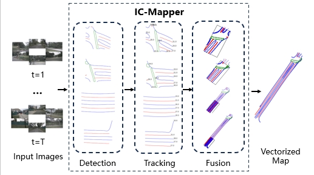

<div align=center>
  
# IC-Mapper: Instance-Centric Spatio-Temporal Modeling for Online Vectorized Map Construction
</div>

This is the official implementaion of paper [***IC-Mapper: Instance-Centric Spatio-Temporal Modeling for Online Vectorized Map Construction***](https://dl.acm.org/doi/pdf/10.1145/3664647.3681285), which is accepted in ***ACM mm 2024***. 

<div align=center>

[![pdf]](https://dl.acm.org/doi/pdf/10.1145/3664647.3681285)

</div>


<div align=center>

</div>


## 1. Contents
- IC-Mapper: Instance-Centric Spatio-Temporal Modeling for Online Vectorized Map Construction
  - [1. Contents](#1-contents)
  - [2. Abstract](#2-Abstract)
  - [3. Results](#3-results)
  - [4. Code Usage](#4-code-usage)
  - [6. Acknowledgment](#6-acknowledgment)
  - [7. Citation](#7-citation)

## 2. Abstract

Online vector map construction based on visual data can bypass the processes of data collection, post-processing, and manual annotation required by traditional map construction, which significantly enhances map-building efficiency. However, existing work treats the online mapping task as a local range perception task, overlooking the spatial scalability required for map construction. We propose IC-Mapper, an instance-centric online mapping framework, which comprises two primary components: 1) Instance-centric temporal association module: For the detection queries of adjacent frames, we measure them in both feature and geometric dimensions to obtain the matching correspondence between instances across frames. 2) Instance-centric spatial fusion module: We integrate features from the detected instances of the current frame with BEV features and spatially sampled points from the historical map.
Then, we concatenate point sets with the same ID to achieve realtime map expansion and updating. Based on the nuScenes dataset, we evaluate our approach on detection, tracking, and global mapping metrics. Experimental results demonstrate the superiority of IC-Mapper against other state-of-the-art methods.

## 3. Results


<div align=center>
Region-level captioning performance on Visual Genome (VG) and RefCOCOg.

</div>


## 4. Code Usage

### DONE:
1. env set: same as streammapnet https://github.com/yuantianyuan01/StreamMapNet/tree/main
2. data: 
    Download NuScenes dataset to ./datasets/nuScenes.
    python tools/data_converter/StreamMap_nuscenes_converter.py --data-root ./datasets/nuScenes --newsplit
3. pretrain: 
bash tools/dist_train.sh ./IC_plugin/configs/track/nusc_newsplit_480_60x30_24e_tracker_asso.py num_gpus
4. train（stage2）:
bash tools/dist_train.sh ./IC_plugin/configs/track_fusion/nusc_newsplit_480_60x30_24e_tracker_asso_fusion.py num_gpus
5. test for detection performance:

    (1) download the model https://drive.google.com/file/d/1GCbQUVqHRTgQMsQcqIHPMF4x6M7fsYP0/view?usp=sharing

    (2) bash tools/dist_test.sh {CONFIG} {CEHCKPOINT} 8 --eval
    
    Example:  bash tools/dist_test.sh ./IC_plugin/configs/track_fusion/nusc_newsplit_480_60x30_24e_tracker_asso_fusion.py ./iter_10440.pth 8 --eval

### TODO:
1. track metrics;
2. mapping metrics;;

### Visulization
<video controls src="vis/output.mp4" title=""></video>


## 5. Acknowledgment


## 6. Citation

```text
@inproceedings{10.1145/3664647.3681285,
author = {Zhu, Jiangtong and Yang, Zhao and Shi, Yinan and Fang, Jianwu and Xue, Jianru},
title = {IC-Mapper: Instance-Centric Spatio-Temporal Modeling for Online Vectorized Map Construction},
year = {2024},
isbn = {9798400706868},
publisher = {Association for Computing Machinery},
address = {New York, NY, USA},
url = {https://doi.org/10.1145/3664647.3681285},
doi = {10.1145/3664647.3681285},
booktitle = {Proceedings of the 32nd ACM International Conference on Multimedia},
pages = {9961–9969},
numpages = {9},
keywords = {detection and tracking, end-to-end online map construction, spatial fusion, temporal association},
location = {Melbourne VIC, Australia},
series = {MM '24}
}
```